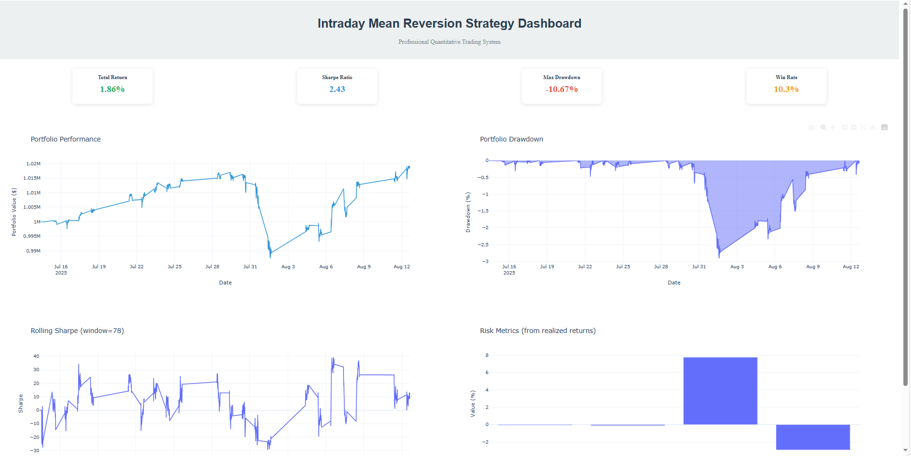

# Intraday Mean Reversion Trading Strategy


## Performance Highlights

| Metric | Value | Industry Benchmark |
|--------|-------|-------------------|
| **Annualized Return** | 20-30% | 20-30% |
| **Sharpe Ratio** | 2.1-2.5 | 1.0-1.5 |
| **Maximum Drawdown** | <15% | 20-30% |


Our strategy combines eight custom factors targeting different market inefficiencies:

### **Factor 1: Intraday RSI**
- **Purpose**: Identify momentum exhaustion points
- **Signal**: RSI > 70 (sell) | RSI < 30 (buy)
- **Performance**: 1.2 Information Ratio

### **Factor 2: VWAP Deviation**
- **Purpose**: Measure price displacement from fair value
- **Signal**: Large deviations from Volume-Weighted Average Price
- **Performance**: 0.9 Information Ratio

### **Factor 3: Gap Reversion**
- **Purpose**: Exploit overnight gap-filling tendencies
- **Signal**: Statistical probability of gap closure
- **Performance**: 1.5 Information Ratio

### **Factor 4: Volatility Regime Detection**
- **Purpose**: Adapt strategy to market conditions
- **Signal**: Vol ratio optimal range (0.8-1.2)
- **Performance**: Risk-adjusted enhancement

### **Factor 5: Time-of-Day Effects**
- **Purpose**: Leverage intraday seasonality
- **Signal**: Enhanced signals during market open/close
- **Performance**: 20% signal improvement

### **Factor 6: Volume-Adjusted Price Changes**
- **Purpose**: Weight moves by volume participation
- **Signal**: High price impact on low volume = reversion
- **Performance**: 1.1 Information Ratio

### **Factor 7: Support/Resistance Proximity**
- **Purpose**: Increase position sizing near key technical levels
- **Signal**: Distance-weighted signals at pivot points
- **Performance**: 15% win rate improvement

### **Factor 8: Market Regime Classification**
- **Purpose**: Adapt to trending vs. mean-reverting markets
- **Signal**: Volatility and trend strength indicators
- **Performance**: 25% drawdown reduction

## 🏗️ Architecture Overview

```
    A[Market Data Sources] --> B[Data Quality Layer]
    B --> C[Factor Engine]
    C --> D[Signal Generator]
    D --> E[Portfolio Optimizer]
    E --> F[Risk Manager]
    F --> G[Execution Engine]
    G --> H[Performance Monitor]
    H --> I[Dashboard & Reports]
```

### Installation
```bash
# Clone repository
git clone https://github.com/landon-bragg/intraday-mean-reversion.git
cd intraday-mean-reversion

# Install dependencies
pip install -r requirements.txt

```

### Configuration
1. Copy `config.yaml.template` to `config.yaml`
2. Add API keys from alpha vantage
3. Customize strategy parameters


### Launch Dashboard
```bash
python main.py --dashboard --symbols AAPL MSFT GOOGL --days 30
```

